# Тестовое задание Backend-разработчик(Java)

REST API для управления позициями в заявке на закупку с учётом строгих бизнес-правил

---

## 📋 Содержание

- [Архитектура взаимодействия](#архитектура-взаимодействия)
- [Технологический стек](#технологический-стек)
- [Сборка проекта](#сборка-проекта)
- [Тестирование](#тестирование)
- [Аутентификация через Swagger](#Аутентификация через Swagger)


---

## ⚙️ Архитектура взаимодействия
Приложение построено по классической слоистой архитектуре с чётким разделением ответственности между 
REST-слоем, сервисным слоем и слоем доступа к данным.

REST Controller -> Service -> Repository (JPA) -> H2 Database

📡 1. REST API (Frontend → Backend)

**Взаимодействие с фронтендом осуществляется через REST API.**

 - приём и валидация входных HTTP-запросов;
 - преобразование JSON → DTO;
 - вызов соответствующих методов сервисного слоя;
 - формирование HTTP-ответов (status + body)

Контроллеры не содержат бизнес-логики и не работают напрямую с сущностями JPA.

🧾 2. Сервисный слой

Сервисный слой является основным координирующим слоем приложения.

Он отвечает за:

 - реализацию бизнес-сценариев;
 - проверку бизнес-правил;
 - работу с агрегатами и сущностями;
 - управление транзакциями;
 - взаимодействие с репозиториями.

🔁 3. Доменная модель

Основные сущности

**PurchaseRequisition** — заявка на закупку
Используется как контекст для операций с позициями и источник бизнес-ограничений
(статус заявки, итоги, ограничения на удаление).

**RequisitionItem** — основная управляемая сущность системы
В соответствии с ТЗ рассматривается как Aggregate Root:

- имеет собственный жизненный цикл,
- использует optimistic locking,
- является объектом REST-операций.


## ⚙️ Технологический стек

- Java 8
- Spring Boot 2.7.x
- Spring Data JPA (Hibernate)
- H2 (in-memory database)
- Bean Validation
- Unit 5
- Mockito
- springdoc-openapi-ui (Swagger)


## ⚙️ Сборка проекта
### 1. JVM Build (Классическая Java-сборка)

```bash 
   mvn clean package
```
### 1. Локальный запуск
```bash
  mvn spring-boot:run
 ```

## ⚙️ Тестирование

### 1. Для создания позиции в заявке на закупку:

```bash
  curl --location 'http://localhost:8080/api/v1/requisitions/1/items' \
--header 'Content-Type: application/json' \
--data '{
    "truCode":"062010.100.000000",
    "truName": "Газ природный",
    "quantity": 0,
    "mkei": "Литр",
    "price": 15000.0,
    "desiredDeliveryDate": "2026-02-26"
}'
````
Ответ: 
```bash
  {
    "id": 3,
    "requisitionId": 1,
    "rowNumber": 2,
    "truCode": "062010.100.000000",
    "truName": "Газ природный",
    "quantity": 3,
    "mkei": "Литр",
    "price": 15000.0,
    "desiredDeliveryDate": "2026-02-26",
    "version": 0
}
````

Ответ, если статус заявки не DRAFT:


Ответ, если неправильно указали дублирующийся truCode:

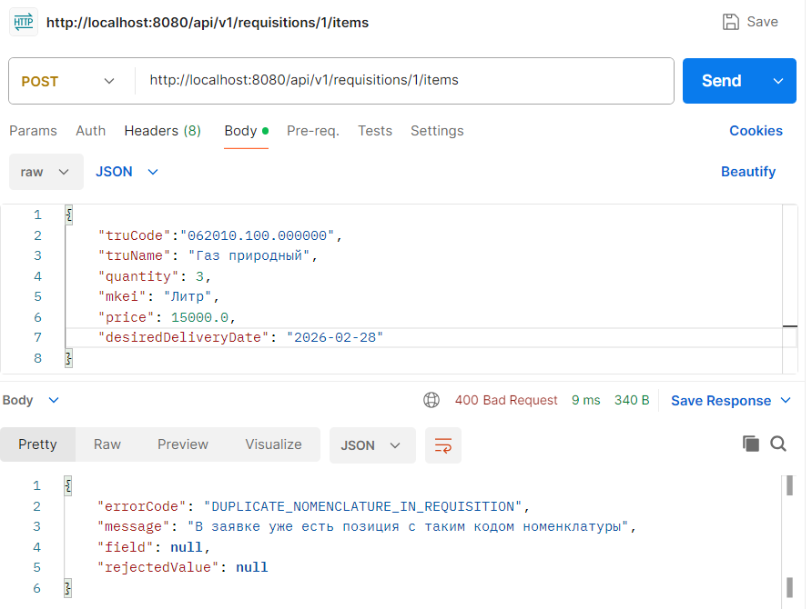

Ответ, если quantity меньше, чем 0:

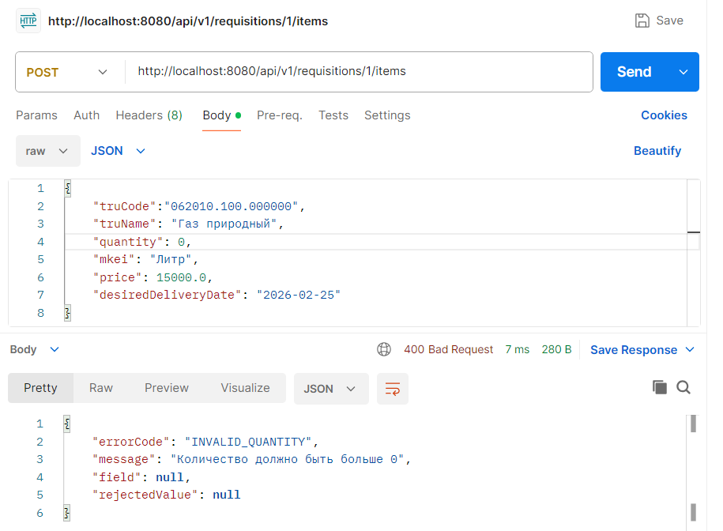

Ответ, если price меньше, чем 0:

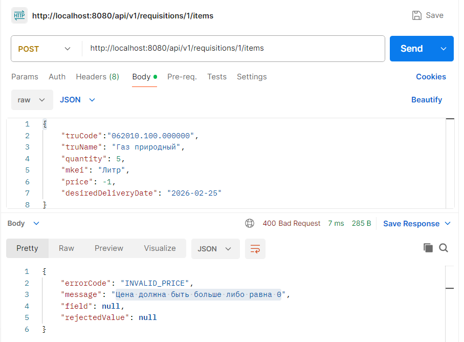

Ответ, если неправильно указали срок поставки:

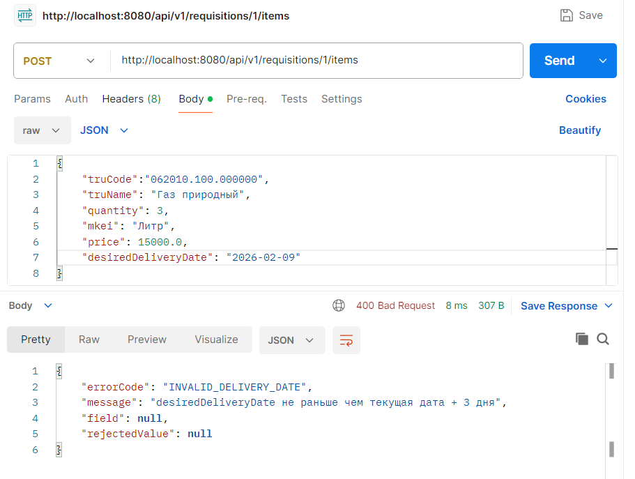

Ответ, если единица измерения не разрешена для номенклатуры:

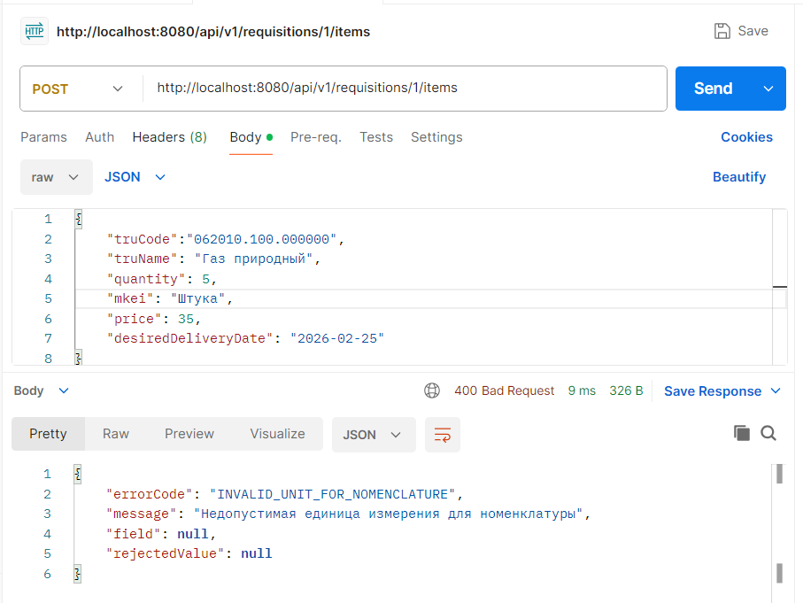


### 2. Для изменения позиции в заявке на закупку:

```bash
curl --location --request PATCH 'http://localhost:8080/api/v1/requisitions/1/items/3' \
--header 'Content-Type: application/json' \
--data '{
    "quantity": 5,
    "desiredDeliveryDate": "2026-03-09",
    "version": 2,
    "comment": "необходимо апдейтить"
}'
````

Удачный ответ при изменении позиции:
```bash
  {
    "id": 3,
    "requisitionId": 1,
    "rowNumber": 2,
    "truCode": "062010.100.000000",
    "truName": "Газ природный",
    "quantity": 5,
    "mkei": "Литр",
    "price": 15000.0000,
    "desiredDeliveryDate": "2026-03-09",
    "version": 0
}
````

### 3. Удаление позиции в заявке на закупку:

```bash
curl --location --request DELETE 'http://localhost:8080/api/v1/requisitions/1/items/3' \
--data ''
````

Ответ при удалении позиции в заявке:

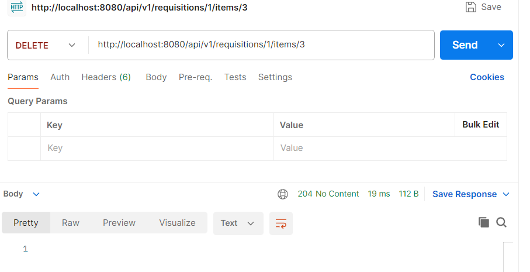


### 4. Summary по заявке на закупку:

```bash
curl --location 'http://localhost:8080/api/v1/requisitions/1/summary'
````
Ответ при получении summary:

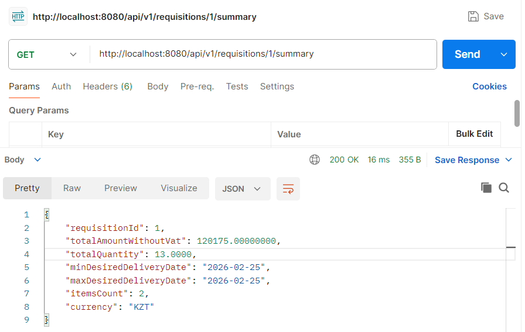

Для проверки, расчета в базе данных таблица REQUISITION_ITEM выглядит так:
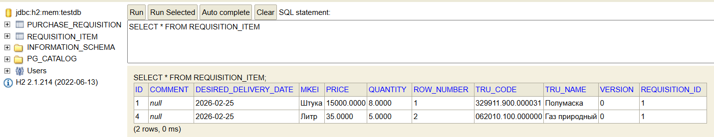

URL Swagger:
```bash
http://localhost:8080/swagger-ui.html
````
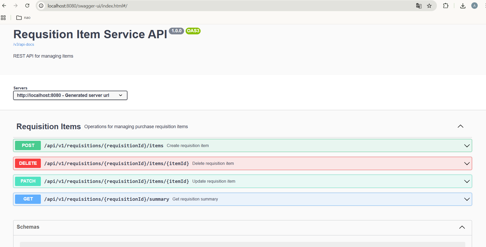

## Аутентификация через Swagger:
  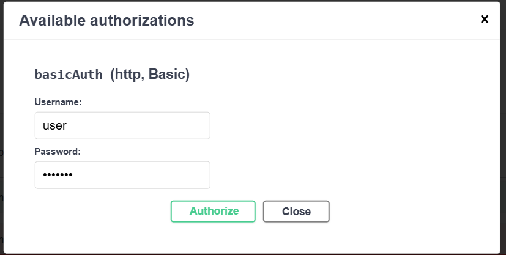

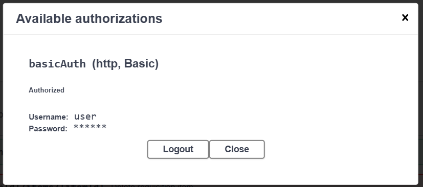

URL H2:
```bash
http://localhost:8080/h2-console
````


